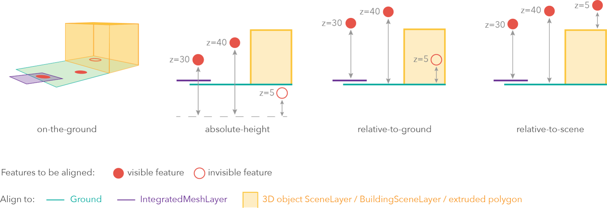
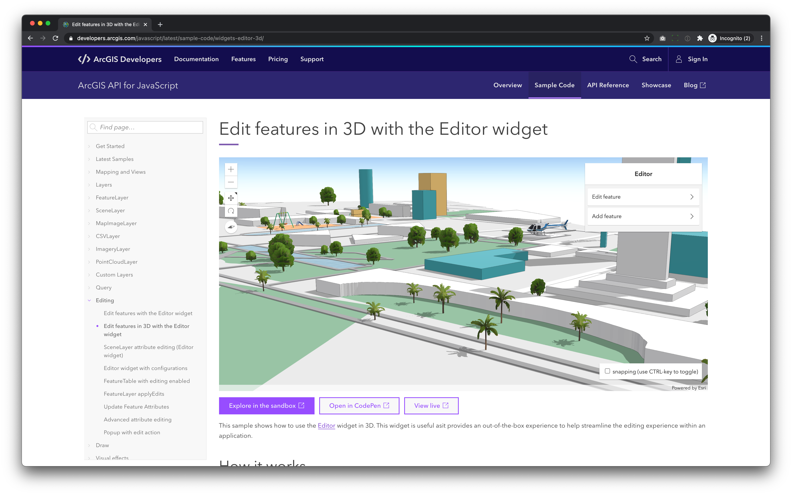
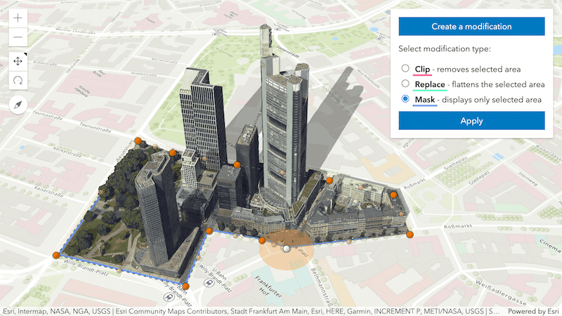
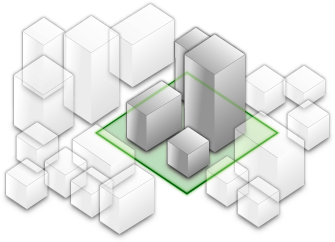
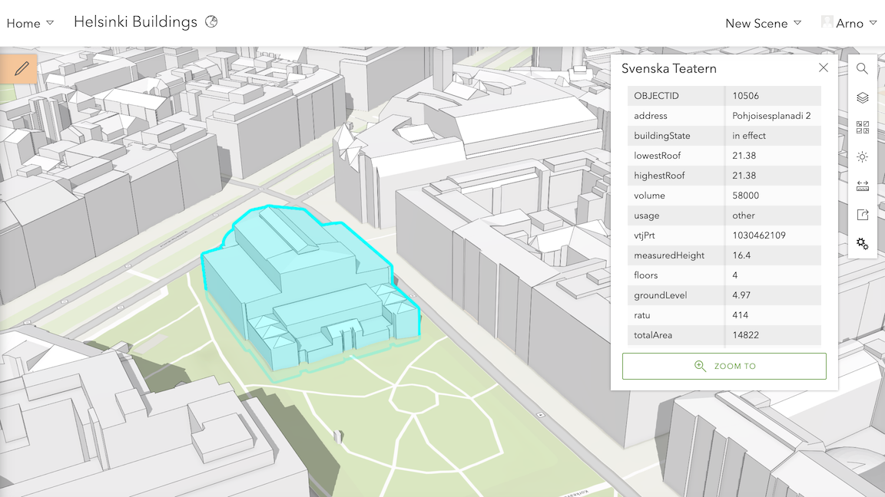
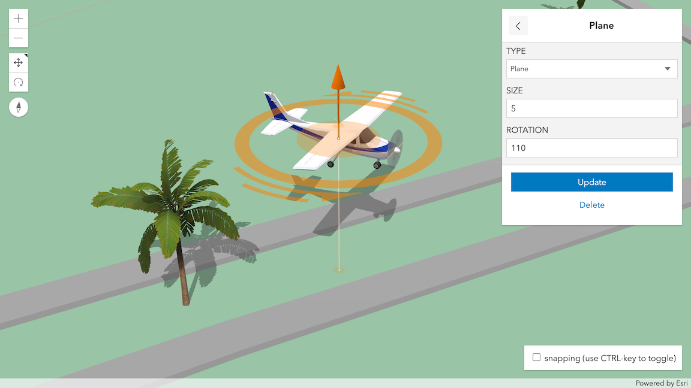

<!-- .slide: data-background="images/bg-1.png" class="title" -->

# ArcGIS API for JavaScript

## Web Editing in 3D

Arno Fiva, Esri R&D Center Zürich \
Roman Cattaneo, Esri R&D Center Zürich

2021 ESRI DEVELOPER SUMMIT​ | Palm Springs, CA

---

<!-- .slide: data-background="images/bg-2.png" -->

## Preface

Browser requirements

- Any _modern_ browser will work (Chrome, Firefox, Microsoft Edge, Safari)
- Mobile: _latest_ Samsung & Apple devices
- Desktop: dedicated graphics card recommended

---

<!-- .slide: data-background="images/bg-2.png" -->

## Agenda

- From 2D to 3D
- 3D feature layer editing applied
- Beyond feature layers

---

<!-- .slide: data-background="images/bg-2.png" -->

## Agenda

- From 2D to 3D
- <!-- .element style="opacity: 0.3;" --> 3D feature layer editing applied
- <!-- .element style="opacity: 0.3;" --> Beyond feature layers

---

<!-- .slide: data-background="images/bg-2.png" data-title="editor-widget-3d" -->

### Using the Editor widget in 3D

<!-- markdownlint-disable html -->
<div class="two-columns">
  <div class="left-column" style="vertical-align: center">

<div class="code-snippet">
<pre><code class="lang-ts">// SceneView diplaying a WebMap
view = new SceneView({
  map: new WebMap({ portalItem: { id: "web-map-id" } }),
});
</code></pre>
</div>

<div class="code-snippet">
<button class="play" id="editor-widget-3d-2"></button>
<pre><code class="lang-ts">// Create an Editor widget
const editor = new Editor({
  view: view
});
// Add widget to top-right of the view
view.ui.add(editor, "top-right");
</code></pre>
</div>

<br/>

- Using the `Editor` widget in a `SceneView` works out of the box
- Usage of `SketchViewModel`, `FeatureForm`, and `Editor` widget is the same in 2D and 3D

</div>

<div class="right-column">
  <iframe data-src="./samples/web-editing-in-3d/editor-widget-3d/index.html" ></iframe>
</div>
</div>
<!-- markdownlint-restore -->

---

<!-- .slide: data-background="images/bg-2.png" -->

### Transition from 2D to 3D

1. Store z-values in the GeoDB
2. Add `ElevationInfo` on the layer (metadata how to interpret the raw z-values)
3. 3D-Symbology for appropriate visualizations

---

<!-- .slide: data-background="images/bg-2.png" -->

### Z-values and elevation modes

<!-- markdownlint-disable html -->
<div>
  
  <p style="text-align:left">Elevation modes define how the API interprets z-values from the GeoDB. Check
  out our
  <a href="https://developers.arcgis.com/javascript/latest/sample-code/scene-elevationinfo/">interactive sample</a>
  on developers.argis.com.</p>
</div>
<!-- markdownlint-restore -->

---

<!-- .slide: data-background="images/bg-2.png" data-title="z-values"-->

### Placing points in 3D in a FeatureLayer

<!-- markdownlint-disable html -->
<div class="two-columns">
  <div class="left-column">

<p style="text-align:left">Two point feature layers: one for boats on the lake and one for flying helicopters.</p>
<div class="code-snippet">
<button class="play" id="z-values-1"></button>
<pre><code class="lang-ts">// Boat feature layer
view.map.add(new FeatureLayer({
  title: "Boat layer",
  elevationInfo: { mode: "on-the-ground" },
  // ...
})
// Helicopter feature layer
// featureLayerWithZ.capabilities.data.supportsZ == true
view.map.add(new FeatureLayer({
  title: "Helicopter layer",
  hasZ: true,
  elevationInfo: { mode: "absolute-height" },
  // ...
}));
// Add the editor widget
widget = new Editor({ view: view });
view.ui.add(widget, "top-right");
</code></pre>
</div>

  </div>
  <div class="right-column">
    <iframe data-src="./samples/web-editing-in-3d/z-values/index.html" ></iframe>
  </div>
</div>
<!-- markdownlint-restore -->

---

<!-- .slide: data-background="images/bg-2.png" data-title="visual-variables"-->

### Using 3D-models as symbology for points in a FeatureLayer

<!-- markdownlint-disable html -->
<div class="two-columns">
  <div class="left-column">

<div class="code-snippet">
<button class="play" id="visual-variables-1"></button>
<pre><code class="lang-ts">view.map.add(new FeatureLayer({
  title: "Boat layer",
  elevationInfo: { mode: "on-the-ground" },
  renderer: new SimpleRenderer({
    // Use a sailboat as symbol for the boat layer
    symbol: {
      type: "web-style",
      name: "Sailboat",
      portal: { url: "https://www.arcgis.com" },
      styleName: "EsriRealisticTransportationStyle"
    },
    visualVariables: [
      { type: "size", field: "size" },
      { type: "rotation", field: "heading"}
    ]
  }),
  // ...
})
</code></pre>
</div>
<div class="code-snippet">
<button class="play" id="visual-variables-2"></button>
<pre><code class="lang-ts">view.map.add(new FeatureLayer({
  title: "Helicopter layer",
  hasZ: true,
  elevationInfo: { mode: "absolute-height" },
  renderer: new SimpleRenderer({
    // Use a helicopter as symbol for the helicopter layer
    symbol: {
      type: "web-style",
      name: "Eurocopter_AS-365_-_Flying",
      portal: { url: "https://www.arcgis.com" },
      styleName: "EsriRealisticTransportationStyle"
    },
    visualVariables: [
      { type: "size", field: "size" },
      { type: "rotation", field: "heading"}
    ]
  }),
  // ...
}));
</code></pre>
</div>

  </div>
  <div class="right-column">
    <iframe data-src="./samples/web-editing-in-3d/visual-variables" ></iframe>
  </div>
</div>
<!-- markdownlint-restore -->

---

<!-- .slide: data-background="images/bg-2.png" -->

### Editor widget in 3D

<!-- markdownlint-disable html -->
<div>


<p>Check out the interactive <a href="https://developers.arcgis.com/javascript/latest/sample-code/widgets-editor-3d/">editing in 3D sample</a> on our <a href="https://developers.arcgis.com/javascript">developer portal</a>.</p>
</div>
<!-- markdownlint-restore -->

---

<!-- .slide: data-background="images/bg-3.png" -->

### Recap: Using the editor widget in 3D

- The editor widget works out of the box going from 2D to 3D
- Editing in 3D allows you to change z-values
- Elevation modes put your z-values in perspective
- 3D manipulators allow you to adjust attribute-driven visualizations

---

<!-- .slide: data-background="images/bg-2.png" -->

## Agenda

- <!-- .element style="opacity: 0.3;" --> From 2D to 3D
- 3D feature layer editing applied
  - Rooftop antenna placement
  - Digitize water
  - Plan sightseeing tour
- <!-- .element style="opacity: 0.3;" --> Beyond feature layers

---

<!-- .slide: data-background="images/bg-2.png" data-title="antenna-placement" -->

### Rooftop antenna placement

Point geometries with `relative-to-scene` elevation mode.

<!-- markdownlint-disable html -->
<div class="two-columns">
  <div class="left-column">

<div class="code-snippet">
<pre><code class="lang-ts">var layer = new FeatureLayer({
  // Add FL with "relative-to-scene" elevation mode
  elevationInfo: { mode: "relative-to-scene", offset: 0 },
  // Disable manipulator for movement in Z-direction
  hasZ: false
  renderer: new SimpleRenderer({
    // Use web-style symbology to add realism
    symbol: {
      type: "web-style",
      name: "Radio_Antenna",
      portal: { url: "https://www.arcgis.com" },
      styleName: "EsriInfrastructureStyle"
    }),
    // Add visual variable to let the user tweak size and rotation of antenna
    visualVariables: [
      { type: "size", axis: "height", field: "size" },
      { type: "rotation", field: "rotation" }
    ]
  }),
  // ...
});
// Add the editor widget
var widget = new Editor({ view: view });
view.ui.add(widget, "top-right");
</code></pre>

</div>

  </div>
  <div class="right-column">
    <iframe data-src="./samples/web-editing-in-3d/antenna-placement/index.html" ></iframe>
  </div>
</div>
<!-- markdownlint-restore -->

---

<!-- .slide: data-background="images/bg-2.png" data-title="water-surface" -->

### Digitize water

Polygon geometries with `on-the-ground` elevation mode.

<!-- markdownlint-disable html -->
<div class="two-columns">
  <div class="left-column">

<div class="code-snippet">
<button class="play" id="water-surface-1"></button>
<pre><code class="lang-ts">// Add a water layer
const waterLayer = new FeatureLayer({
  renderer: {
    type: "simple",
    symbol: {
      type: "polygon-3d",
      symbolLayers: [
        { type: "water" },
      ]
    }
  }
  elevationInfo: { mode: "on-the-ground" },
  // ...
});
</code></pre>

</div>

<div class="code-snippet">
<button class="play" id="water-surface-2"></button>
<pre><code class="lang-ts">// Tweak the water color
new SimpleRenderer({
  symbol: {
    type: "polygon-3d",
    symbolLayers: [
      {
        type: "water",
        waveDirection: 0,
        color: "#978152",
        waveStrength: "slight",
        waterbodySize: "small",
      }
    ]
  }
});
// Enable water reflections
view.environment.lighting.waterReflectionEnabled = true;
</code></pre>
</div>

  </div>
  <div class="right-column">
    <iframe data-src="./samples/web-editing-in-3d/draped-water-surface/index.html" ></iframe>
  </div>
</div>
<!-- markdownlint-restore -->

---

<!-- .slide: data-background="images/bg-2.png" -->

### Sightseeing tour

Line geometries with `absolute-height` elevation mode.

<!-- markdownlint-disable html -->
<div class="two-columns">
  <div class="left-column">

<div class="code-snippet">

```ts
view.map.add(
  new FeatureLayer({
    url: "https://services2.arcgis.com/.../FeatureServer",
    elevationInfo: {
      mode: "absolute-height",
    },
    renderer: {
      /* use PathSymbolLayer3D */
    },
  })
);

const editor = new Editor({ view });
```

</div>

<div class="code-snippet fragment">

```ts
// Access sketch view model
const svm = editor.viewModel.sketchViewModel;

// Called on each vertex move
svm.on("update", (event) => {
  if (event.toolEventInfo.type === "reshape") {
    const graphic = event.graphics[0];
    const line = graphic.geometry; // Polyline

    /* Use vertices in line.path */
  }
});
```

</div>

  </div>
  <div class="right-column">
    <iframe data-src="./samples/web-editing-in-3d/sightseeing-tour.html" ></iframe>
  </div>
</div>
<!-- markdownlint-restore -->

<!-- https://zrh-app-sd-2.esri.com/arcgis-play/f/k4rZ -->

---

<!-- .slide: data-background="images/bg-2.png" -->

### Recap: 3D feature layer editing

- <!-- .element class="fragment" --> Different variations of 3D editing using <code>elevationInfo</code>
- <!-- .element class="fragment" --> Customize workflows using the <code>Editor</code> and <code>SketchViewModel</code> widgets
- <!-- .element class="fragment" --> Edit volumetric symbols using<br /><code>WebStyleSymbol</code>, <code>ObjectSymbol3DLayer</code> <code>PathSymbol3DLayer</code> and <code>ExtrudeSymbol3DLayer</code>

---

<!-- .slide: data-background="images/bg-2.png" -->

## Agenda

- <!-- .element style="opacity: 0.3;" --> From 2D to 3D
- <!-- .element style="opacity: 0.3;" --> 3D feature layer editing applied
- Beyond feature layers
  - Integrated mesh modifications
  - Scene layer attribute editing

---

<!-- .slide: data-background="images/bg-2.png" -->

## Integrated mesh modifications

<!-- markdownlint-disable html -->
<div class="two-columns">
  <div class="left-column">
    
  </div>

  <div class="right-column">
    <ul>
      <li class="fragment">Applied client-side</li>
      <li class="fragment">Does not change underlying data (mesh)</li>
      <li class="fragment">Persist and share with <code>WebScene.save()</code></li>
    </ul>
  </div>
</div>
<!-- markdownlint-restore -->

---

<!-- .slide: data-background="images/bg-2.png" -->

## Integrated mesh modifications

<!-- markdownlint-disable html -->
<div class="two-columns">
  <div class="left-column">

<div>
<table>
  <thead style="background-color: #f3f3f3;">
    </tr>
      <th style="font-size: 0.8em; color: #4a4a4a; border: 1px solid #cacaca;">Clip</th>
      <th style="font-size: 0.8em; color: #4a4a4a; border: 1px solid #cacaca;">Mask</th>
      <th style="font-size: 0.8em; color: #4a4a4a; border: 1px solid #cacaca;">Replace</th>
    </tr>
  </thead>
  <tbody style="background-color: #ffffff;">
    <tr>
      <td style="border: 1px solid #cacaca;"></td>
      <td style="border: 1px solid #cacaca;"></td>
      <td style="border: 1px solid #cacaca;"></td>
    </tr>
    </tr>
      <td style="font-size: 0.7em; color: #4a4a4a; border: 1px solid #cacaca">Removes selected area</td>
      <td style="font-size: 0.7em; color: #4a4a4a; border: 1px solid #cacaca">Displays only selected area</td>
      <td style="font-size: 0.7em; color: #4a4a4a; border: 1px solid #cacaca">Flattens selected area</td>
    </tr>
  </tbody>
</table>
</div>

<p></p>

<div class="code-snippet fragment">

```ts
// Create integrated mesh layer
const imLayer = new IntegratedMeshLayer({ url });

// Select area
const area = new Polygon({ ... });

// Apply modification type
imLayer.modifications = new SceneModifications([
  new SceneModification(area, "replace")
]);
```

</div>

</div>

  <div class="right-column">
    <iframe class="fragment" data-src="./samples/web-editing-in-3d/im-modifications.html" ></iframe>
  </div>
</div>
<!-- markdownlint-restore -->

---

<!-- .slide: data-background="images/bg-2.png" -->

## Integrated mesh modifications

Flatten: expose underground utility

<!-- markdownlint-disable html -->

<!-- markdownlint-restore -->

---

<!-- .slide: data-background="images/bg-2.png" -->

## Scene layer attribute editing

JavaScript API documentation: [Working with Scene Layers](https://developers.arcgis.com/javascript/latest/working-with-scene-layers/)

<!-- markdownlint-disable html -->
<div class="two-columns">
  <div class="left-column" style="width: 50%">
    
  </div>

  <div class="right-column">
    <ul>
      <li class="fragment">Requires associated feature layer
        <div style="text-align: center;">
          
        </div>
      </li>
      <li class="fragment">Attribute edits applied to feature layer</li>
      <li class="fragment">Owner updates scene layer cache in <br />ArcGIS Online/Enterprise</li>
    </ul>
  </div>

  </div>
</div>

---

<!-- .slide: data-background="images/bg-2.png" -->

## Scene layer attribute editing

<!-- markdownlint-disable html -->
<div class="two-columns">
  <div class="left-column" style="width: 35%">

<div class="code-snippet fragment">

```ts
const sceneLayer = new SceneLayer({ ... });

// Same API as for feature layers
await sceneLayer.applyEdits({

  // Only updates
  updateFeatures: [

    new Graphic({
      attributes: {
        OBJECTID: 10506,
        buildingState: "planned",
        ...
      }
    }
  )]
});

console.log("Success");
```

</div>
  </div>

  <div class="right-column">

  <div style="text-align: left;">
    <p class="fragment">JavaScript API automatically:</p>

  <ul>
      <li class="fragment">Applies edits to associacted feature layer</li>
      <li class="fragment">Loads edits from associated feature layer</li>
      <li class="fragment">Uses updated attribute values in renderer and popups</li>
    </ul>

  </div>
  </div>

</div>

<!-- markdownlint-restore -->

---

<!-- .slide: data-background="images/bg-2.png" -->

## Scene layer attribute editing

<!-- markdownlint-disable html -->
<iframe data-src="https://developers.arcgis.com/javascript/latest/sample-code/widgets-editor-3d-scenelayer/live/" ></iframe>
<!-- markdownlint-restore -->

---

<!-- .slide: data-background="images/bg-2.png" -->

## Web Editing in 3D



https://developers.arcgis.com/javascript/latest/sample-code/widgets-editor-3d

---

<!-- .slide: data-background="images/bg-survey.png" -->

---

<!-- .slide: data-background="images/bg-exit.png" -->
